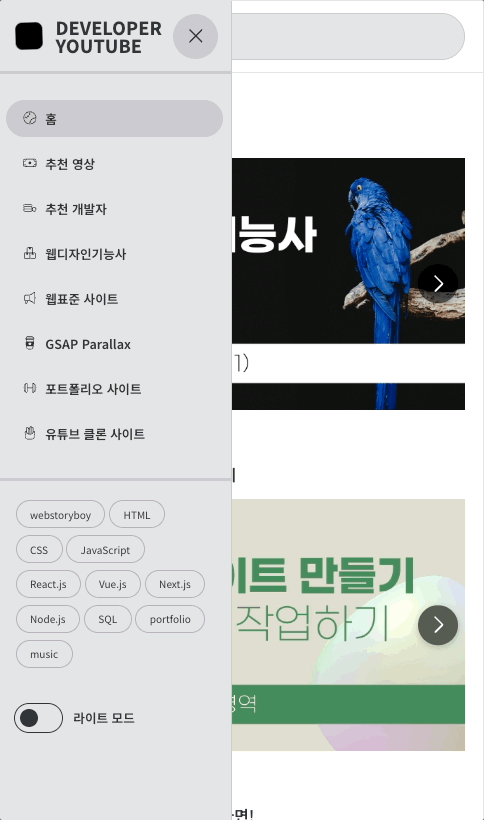

# 🎥 유튜브 사이트

유튜브 API를 활용해 만든 개인 영상 검색·시청 플랫폼입니다.  
외부 데이터를 기반으로 한 서비스 구조를 직접 설계하며,  
**데이터 요청 구조 단순화·비동기 UX·반응형 설계**를 중심으로 구현했습니다.

---

## 🔗 Links

| 구분 | 링크 |
|------|------|
| 🧑‍💻 **Code Repository** | [GitHub – yun-narae/youtube-project](https://github.com/yun-narae/youtube-project) |
| 🌐 **Live Site** | [https://narae-youtube.netlify.app](https://narae-youtube.netlify.app/) |

## 📋 목차

- [프로젝트 소개](#프로젝트-소개)
- [핵심 기능](#핵심-기능)
- [기술적 성과](#기술적-성과)
- [기술 스택](#기술-스택)
- [설치 및 실행](#설치-및-실행)
- [기능 미리보기](#기능-미리보기)
- [프로젝트 구조](#프로젝트-구조)

---
## 🚀 프로젝트 소개

**React와 YouTube Data API**를 활용한 개인 프로젝트로,  
외부 API 중심 서비스의 데이터 흐름과 UI 성능 최적화를 실습했습니다.  
데이터 요청/응답 구조를 단순화하고, **Skeleton UI와 낙관적 업데이트**로  
비동기 UX를 개선해 사용자가 느끼는 체감 속도를 높였습니다.  
ThemeProvider 기반 **다크모드와 반응형 레이아웃**을 적용해  
다양한 환경에서도 일관된 사용자 경험을 제공합니다.

### 📅 프로젝트 정보
- **개발 기간**: 2024.10~2025.01
- **기여도**: 100% (단독 개발)
- **담당 역할**: 기획 · 디자인 · 프론트엔드 개발 · API 연동

---

## 🎯 핵심 기능

- **데이터 연동**: YouTube Data API 기반 영상·채널·카테고리 데이터 호출  
- **검색 기능**: 키워드 기반 실시간 영상 검색  
- **Skeleton 로딩**: 데이터 수신 전 부드러운 로딩 피드백  
- **다크모드**: 사용자 선호에 따른 테마 전환  
- **Swiper 내비게이션**: 키보드·버튼·드래그 등 다중 입력 지원  
- **반응형 디자인**: 모바일·태블릿·데스크톱 전 해상도 대응

---

## 🛠️ 기술적 성과

- **비동기 UX 구현**  
  - Skeleton 최소 노출, 낙관적 업데이트로 체감 속도 개선  
- **데이터 구조 최적화**  
  - API 응답 데이터 구조화 및 캐싱으로 렌더링 효율 개선  
- **UI 일관성 확보**  
  - 공통 컴포넌트 설계 및 색상·간격 토큰 기반 스타일 관리  
- **접근성 강화**  
  - 시맨틱 마크업 및 명도 대비를 고려한 테마 구성  

---

## 📅 프로젝트 정보

| 구분 | 내용 |
|------|------|
| **개발 기간** | 2024.10 ~ 2025.01 |
| **기여도** | 100% (개인 프로젝트) |
| **역할** | 기획 · 디자인 · 프론트엔드 개발 |
| **목표** | 데이터 기반 서비스 구조 설계 및 UX 최적화 실습 |

---

## 🧩 기술 스택

| 분야 | 기술 |
|------|------|
| **Frontend** | React 18, Vite, SCSS |
| **API** | YouTube Data API, RapidAPI |
| **상태관리** | useState, useEffect |
| **UI/UX** | Swiper.js, ThemeProvider |
| **개발환경** | ESLint, Prettier |

---

## 🚀 설치 및 실행

### 1️⃣ 저장소 클론
```bash
git clone https://github.com/yun-narae/youtube-project.git
cd youtube-project
```

### 2️⃣ 의존성 설치
```bash
npm install
```

### 3️⃣ 개발 서버 실행
```bash
npm run dev
```
---

## 🖼️ 기능 미리보기
- youTube Api를 이용하여 데이터를 가져옵니다.
- rapidapi를 이용하여 데이터를 가져옵니다.
- 스켈레톤 로딩과 테마(ThemeProvider) 지원
- 검색 기능을 지원

## 기능 소개
### 1. 반응형


### 2. 다크모드


### 3. 스켈레톤
<p>
  
  
  
</p>

### 4. 검색
<p>
  <strong>유튜브 연동</strong><br />
  
</p>

### 5. 더보기 구현


---

## 📁 프로젝트 구조

```bash
src/
├── components/          # 공통 UI 컴포넌트
│   ├── VideoCard/       # 영상 카드 컴포넌트
│   ├── ChannelCard/     # 채널 카드 컴포넌트
│   ├── Skeletons/       # 스켈레톤 로딩 컴포넌트
│   └── ...
├── hooks/               # Custom Hooks
├── lib/                 # API 호출 및 유틸 함수
├── pages/               # 주요 페이지 (Home, Channel, Search 등)
└── styles/              # SCSS 모듈 및 전역 스타일
```